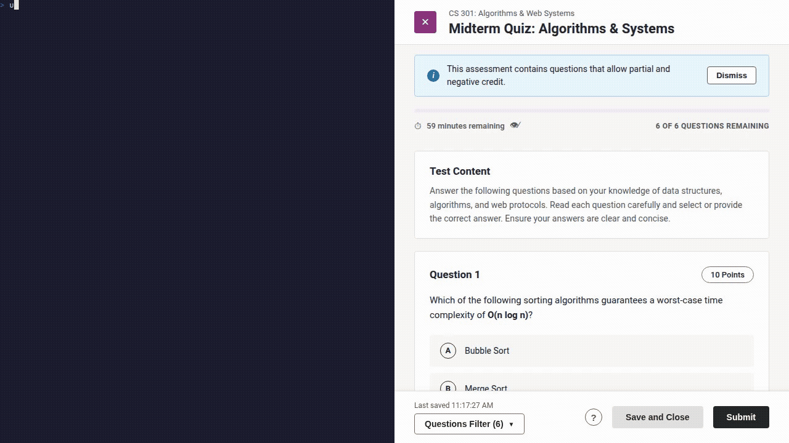

# Blackboard Quiz Solver

> [!NOTE]
> **Educational Disclaimer**: This project is for educational purposes only. Do not use it for any real quizzes. Use at your own risk.

> [!WARNING]
> This tool has not been tested on real quizzes and may not work as expected. Still in development.
> Since the project uses AI to answer the questions, it may not always provide accurate answers. Check the answers before submitting.

Quiz Solver is a CLI tool for Blackboard Learn Ultra quizzes.
It reads questions on the screen, asks Google Gemini AI for answers, and fills the form fields in your browser.

---

<p align="center">
  
</p>

> [!NOTE]
> This demo uses a Blackboard fixture to simulate a quiz.

---

## Safety Rule

The tool fills answers in the browser.
It never clicks submit.
You always review the answers and click submit yourself.

## Requirements

- Python 3.14 or newer
- `uv` package manager
- Google Gemini API key (from https://aistudio.google.com/)

## Installation

1. Install project:

```bash
# Global CLI tool (run directly with `qs`)
uv tool install git+https://github.com/ertanturk/quiz-solver.git

# Local development environment (run with `uv run qs`)
git clone https://github.com/ertanturk/quiz-solver.git
cd quiz-solver
uv sync
```

2. Install the Chromium browser for Playwright:

```bash
uv run playwright install chromium
```

## Setup Credentials

Save your Gemini API key and Blackboard username to the system keyring:

```bash
uv run qs auth setup
```

You can also pass your API key as an environment variable:

```bash
export GEMINI_API_KEY="your-api-key-here"
```

Check your credential status at any time:

```bash
uv run qs auth status
```

## Usage

### Run on Blackboard

Start the solver and open your course quiz:

```bash
uv run qs run --url "https://mef.blackboard.com/"
```

Workflow:

1. The browser opens the login or quiz page.
2. Log in and open your quiz.
3. When questions are visible on screen, press Enter in your terminal.
4. The tool scans questions, asks Gemini AI, and fills each answer.
5. Review answers in your browser and submit manually.

### Run Demo

Test the full pipeline on a local Blackboard fixture without opening the real website:

```bash
# Visible browser
uv run qs demo

# Headless mode (no GUI)
uv run qs demo --headless

# Offline mode without API calls
uv run qs demo --mock

# Custom HTML fixture file
uv run qs demo -p path/to/fixture.html
```

## Supported Question Types

- Single Choice (radio buttons)
- Multiple Choice (checkboxes)
- True / False
- Fill in the Blank (text inputs)
- Matching (dropdown menus)
- Essay / Short Answer (text areas)

## Development and Testing

Run the test suite:

```bash
uv run pytest
```
